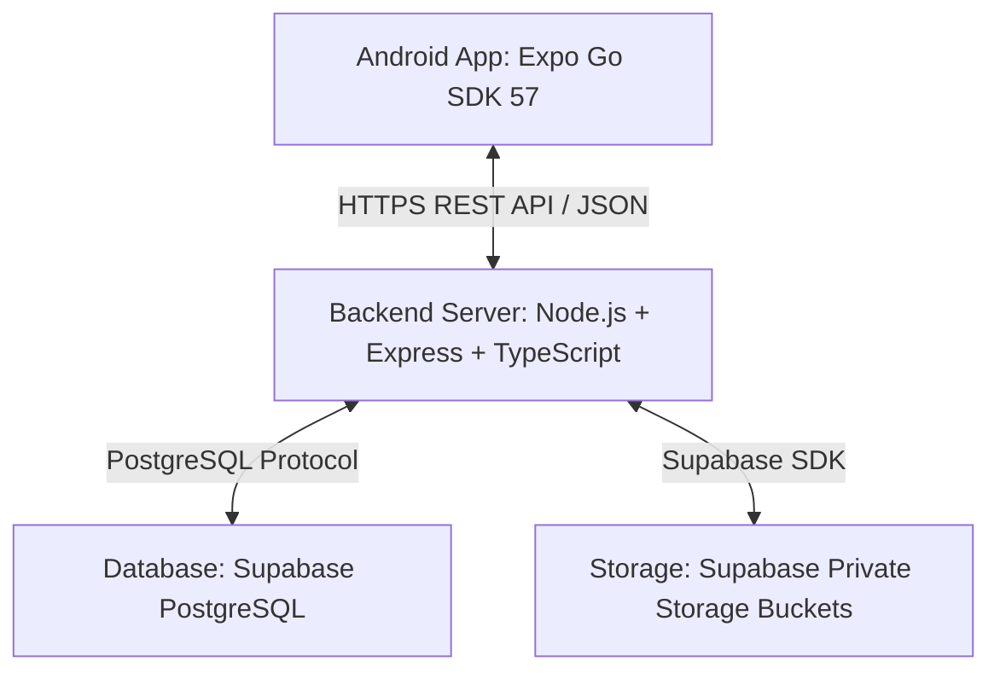
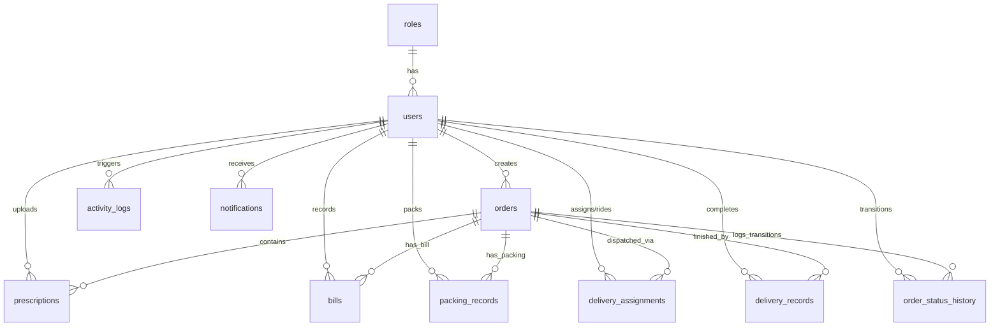
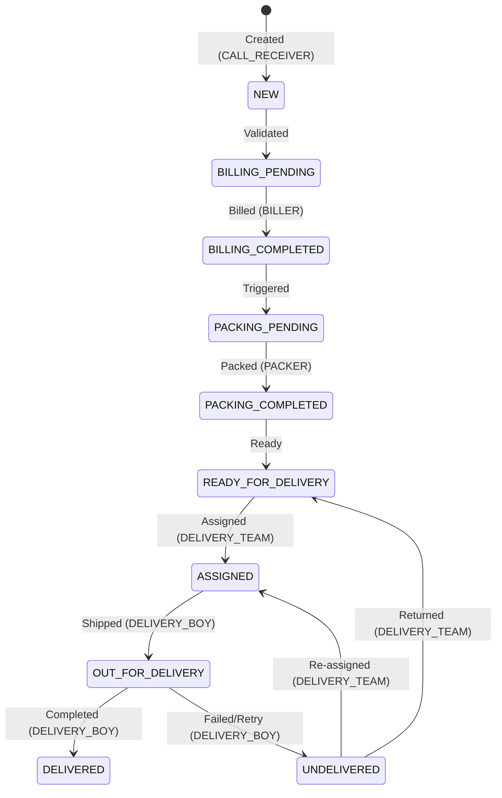

# Phase 2 Implementation Plan: Pharmacy Management Software

This implementation plan details the transition of the Pharmacy Management Software from a mock client-side app to a real client-server application. It is designed to be beginner-friendly, secure, modular, and safe to execute step-by-step.

---

## 1. Current Architecture Analysis

The Phase 1 application is a React Native mobile application built on **Expo SDK 57 (Expo Router)**.
- **State Management**: Data is stored statically inside [mock-data.ts](file:///c:/Users/prati/OneDrive/Desktop/PharmacyManagement/pharmacy-app/src/constants/mock-data.ts).
- **Authentication**: Simple mock validation in [auth-context.tsx](file:///c:/Users/prati/OneDrive/Desktop/PharmacyManagement/pharmacy-app/src/context/auth-context.tsx).
- **User Roles**: Defined in [types.ts](file:///c:/Users/prati/OneDrive/Desktop/PharmacyManagement/pharmacy-app/src/constants/types.ts).
- **UI Screens**: Located in `src/app/(app)/` (grouped by role-specific folders) and `src/app/(auth)/login.tsx`.
- **Transitions**: Controlled by client-side local React states inside individual screen layouts (e.g., [queue.tsx](file:///c:/Users/prati/OneDrive/Desktop/PharmacyManagement/pharmacy-app/src/app/(app)/biller/queue.tsx)).

---

## 2. Recommended Phase 2 Architecture

For Phase 2, the app will transition to a classic three-tier architecture:



### Key Security Guardrails:
- **Zero Direct Access**: The Android app never connects directly to PostgreSQL or utilizes Supabase service-role keys.
- **Backend Mediator**: All business logic, credentials, token verification, and state transitions are processed on the Node.js backend.

---

## 3. Backend Architecture

We will build the backend using **Node.js, Express.js, and TypeScript**.
- **Language**: TypeScript (aligned with the TS config of the frontend, helping beginners catch bugs before execution).
- **Router**: Express Router to modularize endpoints.
- **ORM / Query Builder**: `Prisma` for type-safe queries. Prisma automatically generates TypeScript types from the database schema, which prevents database-related type mismatches.
- **Middleware**:
  - `cors`: Secure Cross-Origin Resource Sharing.
  - `express.json()`: Body parsing.
  - `authMiddleware`: JWT extraction and validation.
  - `roleMiddleware`: Enforcing endpoint-level role-based authorization.

---

## 4. Database Schema

A relational schema hosted on Supabase PostgreSQL. Enforced via foreign key constraints, default values, and indexes for query efficiency.

```sql
-- 1. ROLES TABLE
CREATE TABLE roles (
    id SERIAL PRIMARY KEY,
    name VARCHAR(50) UNIQUE NOT NULL,
    description TEXT,
    created_at TIMESTAMP WITH TIME ZONE DEFAULT CURRENT_TIMESTAMP
);

-- Seed values for Roles (Must match UserRole in types.ts)
INSERT INTO roles (name, description) VALUES
('ADMIN', 'System Administrator with full access'),
('CALL_RECEIVER', 'Staff logging customer details and uploading prescriptions'),
('BILLER', 'Staff generating bills and uploading proofs'),
('PACKER', 'Staff packaging orders and uploading proofs'),
('DELIVERY_TEAM', 'Staff managing dispatching and assignments'),
('DELIVERY_BOY', 'Riders executing deliveries');

-- 2. USERS TABLE
CREATE TABLE users (
    id UUID PRIMARY KEY DEFAULT gen_random_uuid(),
    username VARCHAR(50) UNIQUE NOT NULL,
    email VARCHAR(255) UNIQUE NOT NULL,
    password_hash VARCHAR(255) NOT NULL,
    role_id INTEGER NOT NULL REFERENCES roles(id) ON DELETE RESTRICT,
    full_name VARCHAR(100) NOT NULL,
    created_at TIMESTAMP WITH TIME ZONE DEFAULT CURRENT_TIMESTAMP,
    updated_at TIMESTAMP WITH TIME ZONE DEFAULT CURRENT_TIMESTAMP
);

-- Index for username & email lookups
CREATE INDEX idx_users_username ON users(username);
CREATE INDEX idx_users_email ON users(email);

-- 3. ORDERS TABLE
CREATE TABLE orders (
    id VARCHAR(50) PRIMARY KEY, -- Enforces unique format e.g. ORD-101, ORD-102
    patient_name VARCHAR(100) NOT NULL,
    doctor_name VARCHAR(100) NOT NULL,
    address TEXT NOT NULL,
    contact_number VARCHAR(20) NOT NULL,
    scheduled_datetime TIMESTAMP WITH TIME ZONE NOT NULL,
    status VARCHAR(50) NOT NULL DEFAULT 'NEW',
    created_by_id UUID NOT NULL REFERENCES users(id) ON DELETE RESTRICT,
    created_at TIMESTAMP WITH TIME ZONE DEFAULT CURRENT_TIMESTAMP,
    updated_at TIMESTAMP WITH TIME ZONE DEFAULT CURRENT_TIMESTAMP
);

-- Index on status for queue loading
CREATE INDEX idx_orders_status ON orders(status);

-- 4. PRESCRIPTIONS / ATTACHMENTS TABLE
CREATE TABLE prescriptions (
    id UUID PRIMARY KEY DEFAULT gen_random_uuid(),
    order_id VARCHAR(50) NOT NULL REFERENCES orders(id) ON DELETE CASCADE,
    file_url TEXT NOT NULL,
    uploaded_by_id UUID NOT NULL REFERENCES users(id),
    uploaded_at TIMESTAMP WITH TIME ZONE DEFAULT CURRENT_TIMESTAMP
);

-- 5. BILLS TABLE
CREATE TABLE bills (
    id UUID PRIMARY KEY DEFAULT gen_random_uuid(),
    order_id VARCHAR(50) NOT NULL REFERENCES orders(id) ON DELETE CASCADE,
    amount NUMERIC(10, 2) NOT NULL,
    file_url TEXT NOT NULL,
    billed_by_id UUID NOT NULL REFERENCES users(id),
    billed_at TIMESTAMP WITH TIME ZONE DEFAULT CURRENT_TIMESTAMP
);

-- 6. PACKING RECORDS TABLE
CREATE TABLE packing_records (
    id UUID PRIMARY KEY DEFAULT gen_random_uuid(),
    order_id VARCHAR(50) NOT NULL REFERENCES orders(id) ON DELETE CASCADE,
    file_url TEXT NOT NULL,
    packed_by_id UUID NOT NULL REFERENCES users(id),
    packed_at TIMESTAMP WITH TIME ZONE DEFAULT CURRENT_TIMESTAMP
);

-- 7. DELIVERY ASSIGNMENTS TABLE
CREATE TABLE delivery_assignments (
    id UUID PRIMARY KEY DEFAULT gen_random_uuid(),
    order_id VARCHAR(50) NOT NULL REFERENCES orders(id) ON DELETE CASCADE,
    delivery_boy_id UUID NOT NULL REFERENCES users(id) ON DELETE RESTRICT,
    assigned_by_id UUID NOT NULL REFERENCES users(id) ON DELETE RESTRICT,
    assigned_at TIMESTAMP WITH TIME ZONE DEFAULT CURRENT_TIMESTAMP,
    status VARCHAR(50) DEFAULT 'ASSIGNED' -- ASSIGNED, OUT_FOR_DELIVERY, COMPLETED, FAILED
);

-- 8. DELIVERY RECORDS TABLE (FINAL RECORD)
CREATE TABLE delivery_records (
    id UUID PRIMARY KEY DEFAULT gen_random_uuid(),
    order_id VARCHAR(50) NOT NULL REFERENCES orders(id) ON DELETE CASCADE,
    delivery_boy_id UUID NOT NULL REFERENCES users(id) ON DELETE RESTRICT,
    status VARCHAR(50) NOT NULL, -- DELIVERED, UNDELIVERED
    payment_received BOOLEAN DEFAULT FALSE,
    payment_amount NUMERIC(10, 2) DEFAULT 0.00,
    remarks TEXT,
    recorded_at TIMESTAMP WITH TIME ZONE DEFAULT CURRENT_TIMESTAMP
);

-- 9. ORDER STATUS HISTORY TABLE
CREATE TABLE order_status_history (
    id UUID PRIMARY KEY DEFAULT gen_random_uuid(),
    order_id VARCHAR(50) NOT NULL REFERENCES orders(id) ON DELETE CASCADE,
    previous_status VARCHAR(50),
    new_status VARCHAR(50) NOT NULL,
    changed_by_id UUID NOT NULL REFERENCES users(id),
    remarks TEXT,
    timestamp TIMESTAMP WITH TIME ZONE DEFAULT CURRENT_TIMESTAMP
);

-- 10. ACTIVITY LOGS TABLE (order_id is nullable to support logins, user creation, etc.)
CREATE TABLE activity_logs (
    id UUID PRIMARY KEY DEFAULT gen_random_uuid(),
    user_id UUID NOT NULL REFERENCES users(id) ON DELETE RESTRICT,
    action TEXT NOT NULL,
    order_id VARCHAR(50) NULL, -- Nullable to allow auditing non-order events (e.g. Login/User Creation)
    previous_status VARCHAR(50),
    new_status VARCHAR(50),
    timestamp TIMESTAMP WITH TIME ZONE DEFAULT CURRENT_TIMESTAMP
);

-- 11. NOTIFICATIONS TABLE (For in-app events)
CREATE TABLE notifications (
    id UUID PRIMARY KEY DEFAULT gen_random_uuid(),
    user_id UUID NULL REFERENCES users(id) ON DELETE CASCADE, -- Target individual user (NULL = target entire role)
    role VARCHAR(50) NULL, -- Target a specific user role (e.g., PACKER queue updates)
    title VARCHAR(255) NOT NULL,
    message TEXT NOT NULL,
    read BOOLEAN DEFAULT FALSE,
    created_at TIMESTAMP WITH TIME ZONE DEFAULT CURRENT_TIMESTAMP
);
```

---

## 5. Entity Relationships



---

## 6. Authentication & Session Architecture

We will implement secure session management with **JWT (JSON Web Tokens)**:
1. **Password Security**: Password storage relies on `bcryptjs` hashing with a salt round factor of 10.
2. **Token Structure**: 
   - JWT payload contains: `{ id: string, username: string, role: string }`.
   - Signed using a secure HS256 algorithm.
   - Set with an expiration window of `24h` for convenience in this stage.
3. **Session Verification**:
   - Clients send the JWT inside the HTTP request headers: `Authorization: Bearer <TOKEN>`.
4. **Mobile Token Storage**:
   - The React Native app will store the token securely using `expo-secure-store`. This encrypts values on the device (using Keychains on iOS and Keystores on Android).
5. **Logout Mechanism**:
   - Since JWTs are stateless, the backend does not maintain server-side active sessions. The JWT cannot be invalidated server-side without a custom revocation database or cache (which is out of scope for Phase 2's simplicity).
   - **Logout Execution**: The mobile application will log out by securely deleting the JWT from `expo-secure-store`.
   - **Audit Endpoint**: The mobile app will send a request to `POST /api/auth/logout` prior to deleting the local token. The backend will log a logout event inside `activity_logs` (with a null `order_id`) for audit purposes.

---

## 7. Authorization / Role Permissions

Endpoint protection middleware `roleMiddleware([...allowedRoles])` validates authorization on the backend server.

### Strengthened `GET /api/orders/:id` Authorization rules:
To ensure complete data security, the backend enforces authorization for viewing specific order details:
- **ADMIN**: Can view **any** order.
- **CALL_RECEIVER**: Can view the order **only if** `order.created_by_id == req.user.id`.
- **BILLER**: Can view the order **only if** the status is currently relevant to billing processes: `['NEW', 'BILLING_PENDING', 'BILLING_COMPLETED']`.
- **PACKER**: Can view the order **only if** the status is currently relevant to packing processes: `['BILLING_COMPLETED', 'PACKING_PENDING', 'PACKING_COMPLETED']`.
- **DELIVERY_TEAM**: Can view the order **only if** the status is delivery-related: `['PACKING_COMPLETED', 'READY_FOR_DELIVERY', 'ASSIGNED', 'OUT_FOR_DELIVERY', 'DELIVERED', 'UNDELIVERED']`.
- **DELIVERY_BOY**: Can view the order **only if** the order is explicitly assigned to them (verified via the `delivery_assignments` table).

---

## 8. API Endpoint Specification

All responses use standardized JSON payloads: `{ success: boolean, data?: any, error?: string }`.

### Authentication Endpoints (`/api/auth`)
* `POST /api/auth/login`
  * **Auth Requirement**: None
  * **Request Body**: `{ "username": "...", "password": "..." }`
  * **Response (200)**: `{ "success": true, "token": "...", "user": { "id": "...", "fullName": "...", "role": "..." } }`
  * **Errors**: `400` (Missing fields), `401` (Invalid credentials)
* `POST /api/auth/logout`
  * **Auth Requirement**: Bearer Token
  * **Action**: Logs logout event in `activity_logs`
  * **Response (200)**: `{ "success": true }`

### User Management Endpoints (`/api/users`)
* `GET /api/users`
  * **Auth Requirement**: Bearer Token (ADMIN only)
  * **Response (200)**: `{ "success": true, "users": [...] }`
* `GET /api/users/delivery-boys`
  * **Auth Requirement**: Bearer Token (DELIVERY_TEAM, ADMIN)
  * **Response (200)**: `{ "success": true, "deliveryBoys": [...] }`

### Order Operations Endpoints (`/api/orders`)
* `POST /api/orders`
  * **Auth/Role**: Bearer Token (CALL_RECEIVER)
  * **Request Body**: `{ "patientName": "...", "doctorName": "...", "address": "...", "contactNumber": "...", "scheduledDateTime": "...", "prescriptionUrl": "..." }`
  * **Response (201)**: `{ "success": true, "order": { "id": "ORD-1001", ... } }`
* `GET /api/orders`
  * **Auth/Role**: Bearer Token (All authenticated roles)
  * **Filtering Logic**: 
    * `CALL_RECEIVER`: Only returns orders created by `req.user.id`.
    * `DELIVERY_BOY`: Only returns orders assigned to `req.user.id`.
    * `ADMIN`/`BILLER`/`PACKER`/`DELIVERY_TEAM`: Returns all orders.
* `GET /api/orders/:id`
  * **Auth/Role**: Bearer Token (Enforces **Strengthened Authorization rules** from Section 7)
  * **Response (200)**: Full Order object including status timeline history, signed URLs for attachments.
  * **Errors**: `403 Forbidden` if unauthorized.

### Queue Workflows (`/api/billing`, `/api/packing`, `/api/delivery`)
* `GET /api/billing/queue`
  * **Auth/Role**: Bearer Token (BILLER, ADMIN)
  * **Returns**: Orders where status is `NEW` or `BILLING_PENDING`
* `POST /api/billing/complete`
  * **Auth/Role**: Bearer Token (BILLER)
  * **Request Body**: `{ "orderId": "...", "amount": 120.50, "billProofUrl": "..." }`
  * **Action**: Updates status to `BILLING_COMPLETED` (or `PACKING_PENDING`), logs status history/activity log.
* `GET /api/packing/queue`
  * **Auth/Role**: Bearer Token (PACKER, ADMIN)
  * **Returns**: Orders where status is `BILLING_COMPLETED` (or `PACKING_PENDING`)
* `POST /api/packing/complete`
  * **Auth/Role**: Bearer Token (PACKER)
  * **Request Body**: `{ "orderId": "...", "packingProofUrl": "..." }`
  * **Action**: Updates status to `READY_FOR_DELIVERY`, logs status history/activity log.
* `GET /api/delivery/ready`
  * **Auth/Role**: Bearer Token (DELIVERY_TEAM, ADMIN)
  * **Returns**: Orders where status is `READY_FOR_DELIVERY`
* `POST /api/delivery/assign`
  * **Auth/Role**: Bearer Token (DELIVERY_TEAM)
  * **Request Body**: `{ "orderId": "...", "deliveryBoyId": "..." }`
  * **Action**: Inserts to `delivery_assignments`, updates status to `ASSIGNED`, logs status history/activity log.
* `POST /api/delivery/start`
  * **Auth/Role**: Bearer Token (DELIVERY_BOY)
  * **Request Body**: `{ "orderId": "..." }`
  * **Action**: Updates status to `OUT_FOR_DELIVERY`.
* `POST /api/delivery/complete`
  * **Auth/Role**: Bearer Token (DELIVERY_BOY)
  * **Request Body**: `{ "orderId": "...", "status": "DELIVERED" | "UNDELIVERED", "paymentReceived": true/false, "paymentAmount": 120.50, "remarks": "..." }`
  * **Action**: Inserts to `delivery_records`, updates status to `DELIVERED` or `UNDELIVERED`, logs status history/activity log.

### Administrative Audits (`/api/activity`)
* `GET /api/activity`
  * **Auth/Role**: Bearer Token (ADMIN)
  * **Returns**: Complete system logs ordered by timestamp.

### In-App Notifications (`/api/notifications`)
* `GET /api/notifications`
  * **Auth/Role**: Bearer Token (All authenticated roles)
  * **Action**: Fetches notifications targeting `req.user.id` or targeting user's `req.user.role` (where `user_id` is null).
  * **Response (200)**: `{ "success": true, "notifications": [...] }`
* `POST /api/notifications/:id/read`
  * **Auth/Role**: Bearer Token
  * **Action**: Marks the notification as read.
  * **Response (200)**: `{ "success": true }`

---

## 9. Order Workflow / State Machine

Every status update goes through validation logic in the backend:



### Complete Allowed State Transitions:

| Origin Status | Destination Status | Allowed Actor (Role) | Description |
| :--- | :--- | :--- | :--- |
| **None** | `NEW` | CALL_RECEIVER | Call Receiver creates order and attaches prescription |
| `NEW` | `BILLING_PENDING` | System / Admin | Backend accepts new orders and submits them to Biller queue |
| `BILLING_PENDING` | `BILLING_COMPLETED` | BILLER | Biller calculates amount, uploads bill copy, completes task |
| `BILLING_COMPLETED`| `PACKING_PENDING` | System / Admin | Auto-transitions to Packer queue |
| `PACKING_PENDING` | `PACKING_COMPLETED` | PACKER | Packer packages item, uploads packaging photo |
| `PACKING_COMPLETED`| `READY_FOR_DELIVERY`| System / Admin | Prepared for shipping assignments |
| `READY_FOR_DELIVERY`| `ASSIGNED` | DELIVERY_TEAM | Dispatcher assigns a specific delivery boy |
| `ASSIGNED` | `OUT_FOR_DELIVERY` | DELIVERY_BOY | Delivery boy clicks start delivery |
| `OUT_FOR_DELIVERY` | `DELIVERED` | DELIVERY_BOY | Item delivered successfully, payments logged |
| `OUT_FOR_DELIVERY` | `UNDELIVERED` | DELIVERY_BOY | Delivery attempt fails (remarks required) |
| `UNDELIVERED` | `ASSIGNED` | DELIVERY_TEAM | Re-assigning to same or different delivery boy for attempt |
| `UNDELIVERED` | `READY_FOR_DELIVERY`| DELIVERY_TEAM | Order returned to global ready pool |

*Any other state transition requests will be explicitly rejected by the backend database service layer with an API `400 Bad Request` error.*

---

## 10. Activity Logging Design

- **Status History vs Activity Logs**: 
  - `order_status_history` is a system audit trail exclusively for order updates.
  - `activity_logs` stores broader user actions (e.g., "User logged in", "User added rider").
- **Automatic Triggers**: Transactions will be used to execute the logging query inside the database operations, preventing logging failures from desyncing with the order states.

---

## 11. File Storage Security Model

To prevent unauthorized access to sensitive prescription and billing data, file storage is configured with a strict security model:

1. **Private Buckets**: All Supabase Storage buckets (`prescriptions`, `bills`, `packing`) must be configured as **Private** in the Supabase Dashboard.
2. **Credential Isolation**: The Supabase service-role secret key and connection credentials reside solely on the backend. The mobile app has no direct connection to the storage SDK.
3. **Upload Process**:
   - The React Native mobile client sends file uploads (image/pdf) to backend routes using `multipart/form-data`.
   - The backend validates the uploaded file:
     - **File Type**: Must be `image/jpeg`, `image/png`, or `application/pdf`.
     - **File Size**: Max size limit is set to **5MB**.
   - The backend uploads the validated file buffer to Supabase Storage and records the secure file path in the database.
4. **Authorized Temporary Access**:
   - When fetching order details, the database file path is not exposed directly.
   - The backend uses the Supabase SDK to generate a **temporary signed URL** with an expiration period of **15 minutes** (900 seconds).
   - Only clients that successfully pass the **GET /api/orders/:id authorization rules** can retrieve these signed URLs.

---

## 12. Notification Architecture

- **Future Architecture**: A background notification worker matching order updates to Firebase Cloud Messaging (FCM) push notification tokens stored in `user_push_tokens`.
- **Phase 2 In-App Events**: For Phase 2, we will use the **notifications** database table.
  - **Triggers**: When status transitions, backend inserts a record for users matching the target role (e.g., Biller completing billing generates a notification for Packer role).
  - **Delivery**: The mobile app queries `/api/notifications` periodically or on dashboard loading.

---

## 13. Environment Variables

### Backend Secrets (`backend/.env`)
These variables must **never** be shipped with or exposed to the mobile application:
- `DATABASE_URL`: Connection string containing direct PostgreSQL username/password.
- `JWT_SECRET`: Used to sign tokens. Exposure allows anyone to spoof credentials.
- `SUPABASE_URL` / `SUPABASE_SERVICE_ROLE_KEY`: Supabase administration credentials.
- `PORT`: Port configuration.

### Mobile Variables (`.env` or Config)
- `API_BASE_URL`: Base API address.
  - *Crucial Beginner Tip*: When testing on a **physical device** over Expo Go, using `localhost` or `127.0.0.1` will fail. You must set `API_BASE_URL` to your local development machine's network IP (e.g., `http://192.168.1.100:5000`).

---

## 14. Folder Structure

We recommend the **Nested Decoupled Monorepo Structure**. This keeps mobile and backend in one repository for ease of management while ensuring clean separation.

```
pharmacy-app/
├── backend/                  <-- [NEW] Backend Directory
│   ├── src/
│   │   ├── config/           <-- DB client (Prisma/PG), environment imports
│   │   ├── controllers/      <-- Route logic (authController, orderController)
│   │   ├── middleware/       <-- authMiddleware, roleMiddleware
│   │   ├── routes/           <-- Express API routes
│   │   ├── app.ts            <-- Express app initialization
│   │   └── server.ts         <-- HTTP Server entry point
│   ├── prisma/               <-- Schema files & migrations
│   │   └── schema.prisma
│   ├── package.json          <-- Backend dependencies
│   ├── tsconfig.json         <-- TS configuration
│   └── .env                  <-- Secrets (git-ignored)
├── src/                      <-- Mobile App Source (Phase 1)
│   ├── app/                  <-- Routing screens
│   │   ├── (auth)/
│   │   └── (app)/
│   ├── constants/
│   ├── context/
│   └── services/             <-- [NEW] API services (api-client.ts)
├── package.json              <-- Mobile App dependencies
└── app.json                  <-- Expo configuration
```

---

## 15. Migration Strategy from Mock Data

To ensure Phase 1 UI never breaks during development:

1. **Configuration Toggle**: Add a toggle in `src/constants/config.ts`:
   ```typescript
   export const CONFIG = {
     USE_MOCK: true, // Set to false when integration starts
     API_BASE_URL: 'http://192.168.x.x:5000/api',
   };
   ```
2. **API Client Integration**: Write `src/services/api-client.ts` implementing endpoints.
3. **Graceful Fallbacks**: Inside dashboard pages, query endpoints depending on `CONFIG.USE_MOCK`:
   ```typescript
   useEffect(() => {
     if (CONFIG.USE_MOCK) {
       setOrders(MOCK_ORDERS);
     } else {
       fetchOrdersFromAPI();
     }
   }, []);
   ```
4. This allows testing Biller screen, Packer screen, etc., one-by-one by switching endpoints selectively.

---

## 16. Testing Strategy

### API Tests
- Use `Jest` + `Supertest` on the backend.
- Test user logins, invalid tokens, invalid role accesses (e.g. Packer trying to access Biller endpoints).
- Test transition rules (e.g., verifying `NEW` -> `DELIVERED` status transitions return a validation error).

### E2E Testing Script Flow (Sequential Run)
1. Call Receiver logs in → Creates `ORD-2001` → Prescription uploaded.
2. Biller logs in → Fetches queue → Selects `ORD-2001` → Completes Billing.
3. Packer logs in → Fetches queue → Selects `ORD-2001` → Completes Packing.
4. Delivery Team logs in → Assigns `ORD-2001` to `Driver Jack`.
5. Delivery Boy logs in → Selects assigned queue → Marks `ORD-2001` as Delivered.
6. Admin logs in → Checks `ORD-2001` status history timeline to ensure all logs mapped correctly.

---

## 17. Deployment Strategy

- **Database**: PostgreSQL hosted on **Supabase** (Free Tier).
- **Backend**: Hosted on **Render.com** or **Railway.app** (Simple Git-based web services supporting Node/TS deployment).
- **Mobile**: Expo Application Services (EAS) → `.apk` files.

---

## 18. Implementation Phases

```
┌─────────────────────────────────────────────────────────────┐
│ PHASE A: Database Setup & Seed Data                         │
│ (Create Supabase project, execute schema SQL, seed users)   │
└──────────────────────────────┬──────────────────────────────┘
                               │
                               ▼
┌─────────────────────────────────────────────────────────────┐
│ PHASE B: Backend Auth & User Route Development              │
│ (Build server, JWT validation middlewares, login endpoints) │
└──────────────────────────────┬──────────────────────────────┘
                               │
                               ▼
┌─────────────────────────────────────────────────────────────┐
│ PHASE C: Backend Order & State Transition Engine            │
│ (Order creation APIs, status state validator endpoints)      │
└──────────────────────────────┬──────────────────────────────┘
                               │
                               ▼
┌─────────────────────────────────────────────────────────────┐
│ PHASE D: Mobile Integration - Authentication               │
│ (Secure credentials storage, switch logins to use API)      │
└──────────────────────────────┬──────────────────────────────┘
                               │
                               ▼
┌─────────────────────────────────────────────────────────────┐
│ PHASE E: Mobile Integration - Order Flows & File Uploads    │
│ (Hook up Billing, Packing, and Delivery screens to API)     │
└─────────────────────────────────────────────────────────────┘
```

---

## 19. Risks and Safeguards

| Risk | Mitigation Safeguard |
| :--- | :--- |
| **Exposure of Secrets in APK** | Do NOT import `.env` variables containing secrets in mobile code. The mobile app should only know `API_BASE_URL`. |
| **Physical Phone Network Failure** | Ensure the development machine and the physical phone are connected to the **same Wi-Fi network**. Set firewall rules on the machine to allow incoming requests on Express port (e.g. 5000). |
| **Database Connection Leaks** | Use singleton database client connection pooling. Prisma handles this automatically. |

---

## 20. Exact Manual Steps Required From Developer

1. **Supabase Console Setup**:
   - Create a free Supabase project.
   - Go to Database → SQL Editor, paste the SQL schema script, and run it.
   - Go to Project Settings → Database, retrieve the `URI` string (with password) to use as `DATABASE_URL`.
2. **Backend Server Setup**:
   - Create `/backend` folder.
   - Initialize node project (`npm init -y`) and install TypeScript.
   - Create `.env` file with `DATABASE_URL` and `JWT_SECRET`.
3. **Seeding Dev Users**:
   - Write a node seed script `npm run seed` to insert mock users (with hashed passwords) into the `users` table corresponding to the login usernames used in Phase 1 (so credentials remain matching for testing).

---

## 21. Complexity Estimates

- **Phase A (DB Setup)**: Small (2 hours)
- **Phase B (Auth Server)**: Medium (4-6 hours)
- **Phase C (Workflows API)**: Large (8-10 hours)
- **Phase D (Mobile Auth Migration)**: Medium (3-4 hours)
- **Phase E (Mobile Queues Migration)**: Large (10-12 hours)

---

## 22. Future Phase 3+ Scope (Medicine & Stock Management)

The following capabilities are excluded from the Phase 2 scope to maintain development focus, and are deferred to Phase 3:
- **Medicine Database**: Medicine catalogs, drug categories, formulation types.
- **Inventory/Batch Control**: Supplier management, purchase orders, batch numbers, stock count, and automated low-stock warnings.
- **Expiry Tracking**: Tracking expiration dates by batch and sorting items automatically by FIFO (First In, First Out).
